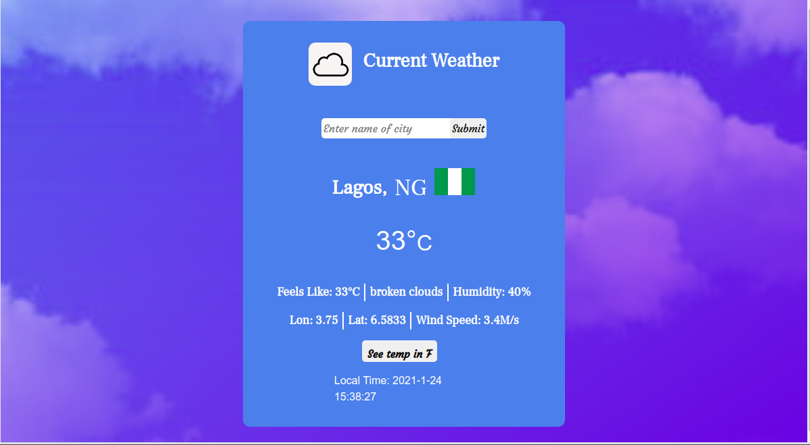
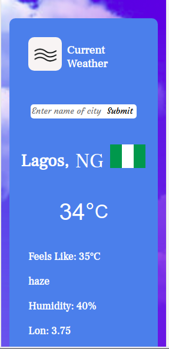

# My Weather Information App

This weather information app gives current weather information about a city. This application is designed to display the current weather information of Lagos, a city in Nigeria by default. Users can enter the name of any major city in the world using the input form and click on submit button to fetch the current weather information for that particular city. This app uses JavaScript async/await property to fetch current weather information from the OpenWeatherMap API. It will also fetch an image of the flag of the country in which the city is located. This URL, https://www.countryflags.io/[country code]/flat/64.png becomes the source of the flag image if the equivalent country code is received from the OpenWeatherMap API. The current weather icon, the country flag, city name, city code, the current temperature of the city are displayed for the user. Other selected weather information of the city are also displayed accordingly. The displayed temperature can be toggled between Celsius and Fahrenheit values by clicking the button with the label (See temp in F) at the bottom of the app. The app also displays the current date and time of the user accessing the weather information. This app is fully responsive and can be viewed on mobile devices and tablets. 

## Preview

## Desktop view


## Tablet view


## Mobile view


## Features 
- User can enter the name of any major city in the world using the input form.
- App displays the current weather information icon of the city.
- App displays city name, country code, and temperature.
- Temperature can be toggled between Fahrenheit and Celsius.
- App displays the current flag of the selected city.
- App displays the local date and time of the user based on the device time setting.

## Project SetUp

Get a local copy of the file. Clone with HTTPS using the command below.

```
git clone https://github.com/Zubenna/weather-info-app.git
```
## Access project folders 
```
cd weather-info-app, then, cd dist.
```
- Click on index.html to display the application on the browser.
- Text all application features.

## Live Version
- [Launch App](https://zubenna.github.io/weather-info-app/)

## Built With
- JavaScript
- Webpack
- HTML
- CSS
- Bootstrap 4

## Author

👤 **Nnamdi Emelu**
- Github: [@zubenna](https://github.com/zubenna)
- Twitter: [@zubenna](https://twitter.com/zubenna)
- Linkedin: [nnamdi-emelu](https://www.linkedin.com/in/nnamdi-emelu/)

##  Contributing

Contributions, issues, and feature requests are welcome!

Feel free to check the [issues page](https://github.com/Zubenna/weather-info-app/issues)

## Show your support

Give a star if you like this project!

## Acknowledgments
- Project originally taken from The Odin Project
- Project inspired by Microverse Program