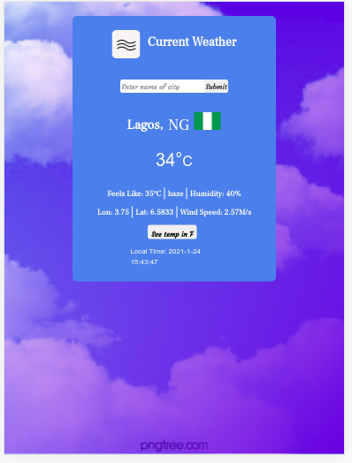

# My Weather Information App


## Preview

## Desktop view


## Tablet view


## Mobile view


## Features 


## Project SetUp

Get a local copy of the file. Clone with HTTPS using the command below.

```
git clone https://github.com/Zubenna/weather-info-app.git
```
## Access project folders 
```
cd weather-info-app, then, cd dist.
```
- Click on index.html to display the application on the browser.
- Text all application features.

## Live Version
- [Launch App]()

## Built With
- JavaScript
- Webpack
- HTML
- CSS
- Bootstrap 4

## Author

👤 **Nnamdi Emelu**
- Github: [@zubenna](https://github.com/zubenna)
- Twitter: [@zubenna](https://twitter.com/zubenna)
- Linkedin: [nnamdi-emelu](https://www.linkedin.com/in/nnamdi-emelu/)

##  Contributing

Contributions, issues, and feature requests are welcome!

Feel free to check the [issues page](https://github.com/Zubenna/weather-info-app/issues)

## Show your support

Give a star if you like this project!

## Acknowledgments
- Project originally taken from The Odin Project
- Project inspired by Microverse Program